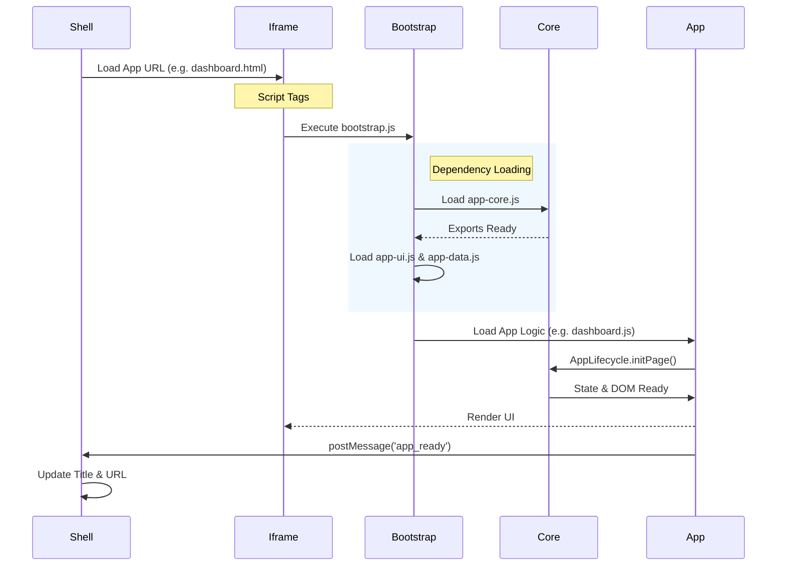

# 🗺️ System Architecture

> A high-level map of the Sidebar Productivity Suite.

## 🏗️ System Context

The application follows a **Shell Architecture**. The `index.html` (Shell) acts as the host environment, loading individual applications into a sandboxed `iframe`.

```mermaid
graph TD
    User((User))

    subgraph "Host Environment"
        Shell[Shell (index.html)]
        Nav[Navigation Bar]
        Iframe[App Container (Iframe)]
    end

    subgraph "Core Layer (Shared)"
        Bootstrap[bootstrap.js<br/>(Dependency Loader)]
        Core[app-core.js<br/>(Lifecycle & Utils)]
        UI[app-ui.js<br/>(Components)]
        Data[app-data.js<br/>(Persistence)]
    end

    subgraph "Application Layer"
        Dash[Dashboard]
        Calc[Calculator]
        Look[Lookup]
        Mail[MailTo]
        Pass[Passwords]
    end

    subgraph "Workers & Libs"
        Worker[MsgWorker]
        Msg[MsgReader.js]
    end

    User -->|Interacts| Shell
    Shell -->|Manages| Nav
    Shell -->|Loads| Iframe

    Iframe -->|Runs| Bootstrap
    Bootstrap -->|Injects| Core
    Core --> UI
    Core --> Data

    Bootstrap -->|Loads| Dash
    Bootstrap -->|Loads| Calc
    Bootstrap -->|Loads| Look
    Bootstrap -->|Loads| Mail
    Bootstrap -->|Loads| Pass

    Mail -.->|Spawns| Worker
    Worker -->|Imports| Msg

    style Shell fill:#f9f,stroke:#333
    style Bootstrap fill:#ff9,stroke:#333
    style Core fill:#ccf,stroke:#333
    style UI fill:#ccf,stroke:#333
    style Data fill:#ccf,stroke:#333
    style Worker fill:#eef,stroke:#333
```

## 🚀 Bootstrapping Sequence

How an application page initializes within the shell.



## 📦 Core Modules

| Module | Responsibility | Key Exports |
| :--- | :--- | :--- |
| **app-core.js** | The "Standard Library". Handles lifecycle, dates, and basic DOM. | `AppLifecycle`, `SafeUI`, `DateUtils` |
| **app-ui.js** | Reusable UI components. | `ListRenderer`, `SharedSettingsModal`, `UIPatterns` |
| **app-data.js** | Data persistence and transformation. | `BackupRestore`, `CsvManager`, `DataValidator` |

## 📧 MailTo Worker Flow

The MailTo app uses a Web Worker to parse binary `.msg` files off the main thread.

```mermaid
graph LR
    User[User] -->|Drops File| App[MailTo App]
    App -->|postMessage(ArrayBuffer)| Worker[MsgWorker]

    subgraph "Background Thread"
        Worker -->|Imports| Reader[MsgReader.js]
        Reader -->|Parses| Buffer[Binary Data]
        Buffer -->|Returns| JSON[Clean JSON]
    end

    Worker -->|postMessage(JSON)| App
    App -->|Updates| UI[Editor UI]
```
